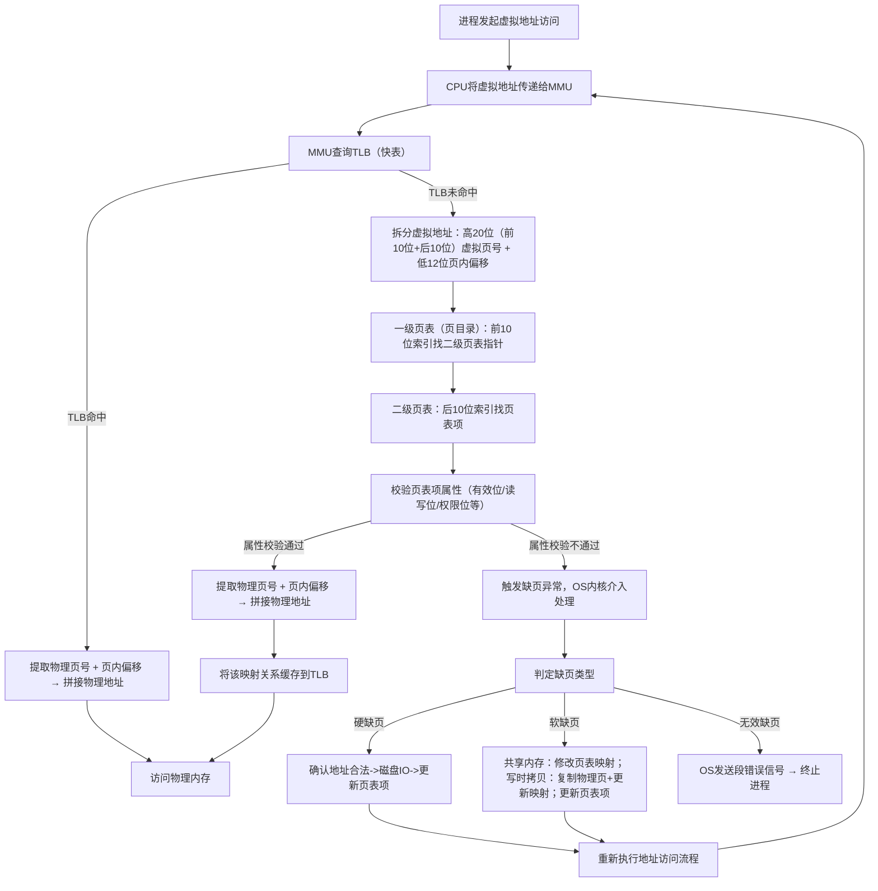

注意：页框和页大小一样，只是为了区分物理和虚拟，本文统称为页

# 为什么要有虚拟内存

虚拟内存的本质是**给每个进程提供一个独立、连续、受保护、可控制的**抽象空间

> ==没有虚拟内存会发生什么？==

* **进程无法天然隔离**

  * 进程A可以访问某段物理地址
  * 进程B也能访问这段地址

  

* **程序需要连续的空间，但是物理内存是离散的**

  真实物理内存长期运行一定会碎片化，不能高效按需分配了

  

# 怎么解决上述问题？

加个中间层！

```txt
进程
虚拟内存
物理内存
```

把所有进程使用的地址隔离开，让每个进程都有独立的一套**虚拟地址**，每个进程都有，大家自己使用自己的地址，互不干扰，现在每个进程就不会直接访问物理内存了 

**OS提供一种机制，把不同进程的虚拟地址和不同的物理内存进行映射**

虚拟地址通过MMU操作，映射到真实的物理地址


# 内存分页机制

**分页是把连续的虚拟地址空间映射到离散的物理页框上**，这个固定大小的内存空间叫做页（针对虚拟内存）或页框（针对物理内存），Linux下，一页为`4KB`

> ==通过什么方式映射==

虚拟地址和物理地址通过**页表（连续的数组）**来映射，页表存储在内存中，MMU把虚拟地址转换成物理地址，当进程访问的虚拟地址在页表中查不到时，触发**缺页异常**，系统进入内核分配物理内存，更新页表，最后返回用户空间，回复进程运行


> ==具体怎么映射==  

* 把虚拟内存地址切分成**页号**和**页偏移量**
* 根据页号，从页表里面，查询对应的物理页号
* 拿物理页号，加上前面的偏移量，得到真实物理地址


> ==一次映射有什么缺陷？==

在32位操作系统，一个进程看到的虚拟地址空间大小是：

​																			$2^{32} = 4GB$

页表大小是4KB:

​																			$4KB = 2^{12}$

整个4GB空间会被分割成：

​																			$2^{32} \div 2 ^{12} = 2^{20}$  大约100万张页表

使用一级页表：

* 每个虚拟页号，对应一个物理页号，就形成一个页表项（映射关系）

* 一共有$2^{20}$个页表项

* 每个页表项4字节

  页表大小是：$2^{20} \times 4字节 = 4MB$				

那么就会出现如下问题：

* 页表太大，100个进程就要400MB了
* 很多页表根本用不到，虚拟地址空间是4GB，但是一个进程并不会真的把4GB全用满了，**不管你用不用，以及页表都会把整个4GB地址空间对应的页表项准备好，浪费很多空间**
* 连续大的内存不好找，页表是一个很大的线性数组，分配管理不方便

# 多级页表

连续大的数组太难存，就把数组打散！把4MB的大表切割成1024个小表（4KB），散落在内存中--->形成二级页表，每个二级页表又包含1024个页表项

拆完之后的结构：

* 一级页表：页目录，放1024个指针，每个指针指向一个二级页表
* 二级页表：页表项，放1024个真正的映射关系

> ==现在32位地址怎么拆分才能支持二级查找？==

* 高20位：虚拟页号
  * 前10位：去一级页表找二级页表位置
  * 后10位：去二级页表找对应物理页号
* 低12位：页内偏移--->找到最终物理地址


> ==为什么多级页表会省内存？==

原来的一级页表必须全部分配：

* 1024个小表
* 每个小表4KB
* 全部分配4MB

**二级页表是按需分配**，只给**真正用到的虚拟地址**分配对应的二级页表

举个例子：

假设一个进程用了8MB虚拟空间：

​													$8MB \div 4KB = 2^{32} \div 2^{12} = 2^{11} = 2048页 $

每个二级页表可以管理1024页，

2048页只需要**2个二级页表！**，外加一个一级页表

内存开销：

​													$4KB + 8KB = 12KB$

多级页表的本质就是按需分配！

# TLB

多级页表解决了空间问题，现在多级页表之间的映射时间问题TLB来解决

根据**程序局部性原理：**

**在一段时间内，整个程序的执行仅限于程序中的某个部分，相应的，执行所访问的存储空间页局限于某个内存区域**

CPU给MMU传新的虚拟地址之后，MMU先去问TLB那边有没有，有的话直接拿物理地址，不用查表了。

但是TLB容量较小，难免会缓存未命中，此时才走页表，找到物理内存，还没完！

TLB会把这条映射关系所在的页缓存，后面利用局部性原理，就能减少查表了！


# 页表项的属性

上文中是为了宏观理解，把页表项当作虚拟页号和物理页号的映射关系，宏观上没有问题

现在从微观角度剖析：

页表项由**物理页号+一组属性位**构成

具体的属性有：

* 有效位：缺页异常的开关
  * 标识**当前虚拟页对应的物理页是否在内存中**
  * 程序访问某个地址时，MMU查到有效位是0，触发缺页异常，内核去磁盘找对应的物理内存
* 读写位
  * 标识这块内存的访问权限
  * 只读区域被写了，触发缺页异常
* 权限位
  * 标识这个页是用户态可以访问，还是只有内核态才能访问
  * 用户态访问了内核态专属页，触发缺页异常
* 修改位
  * 标识这个页被加载到内存中，有没有被修改过
  * 物理内存满了，OS要把某页放回磁盘，先看修改位：
    * 修改位0，说明没有修改过，直接丢弃，**节省一次磁盘写操作**
    * 修改位1，老老实实写回磁盘更新

# 缺页异常

缺页异常的本质是**MMU校验页表项属性不达标，无法完成地址翻译，向操作系统发送的求救信号**

分为三种缺页：

* 硬缺页
  * 场景：程序启动加载大文件，内存不够用，数据被换到了磁盘上
  * 流程：
    * 查表发现有效位为0
    * 内核判断是合法的地址，但是数据在磁盘中
    * OS发起次磁盘IO，直到数据读完，把物理页填到页表，更新有效位
    * 重新执行上次中断的命令
* 软缺页
  * 场景：
    * 共享内存：两个进程同时加载一个动态库，A已经加载到内存了，B访问，触发缺页
    * 写时拷贝：`fork`出子进程一开始和父进程共享物理内存（只读），两个进程有一个尝试写数据，触发缺页
  * 流程：
    * 查表发现有效位为0或者读写位不匹配
    * 内核判断数据已经在物理内存or触发写时拷贝逻辑
    * 不进行磁盘IO，只修改页表映射关系（共享内存）或者复制物理页（写时拷贝）
    * 重新执行上次中断的命令
* 无效缺页：
  * 场景：
    * 空指针解引用、操作野指针
    * 越界访问：访问没有申请的虚拟地址
    * 权限错误：写只读段、用户态访问内核态地址
  * OS判断行为不合法
  * 直接发信号，显示段错误
  * 杀死进程

# 总结虚拟地址到物理地址映射全流程




done~